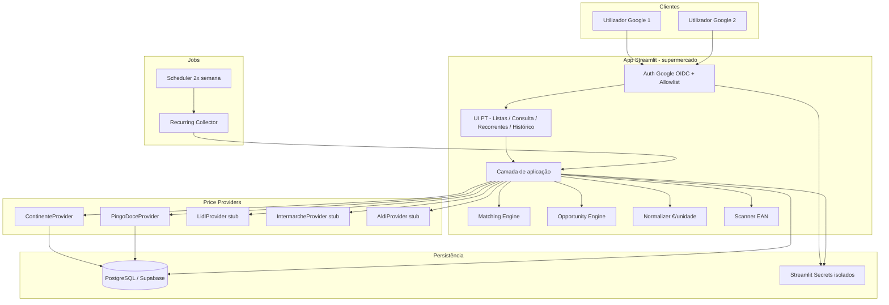
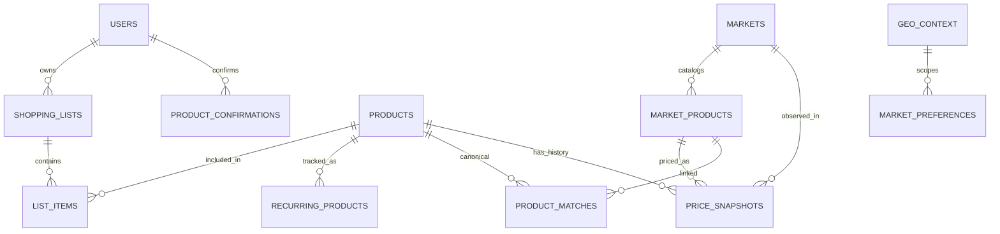
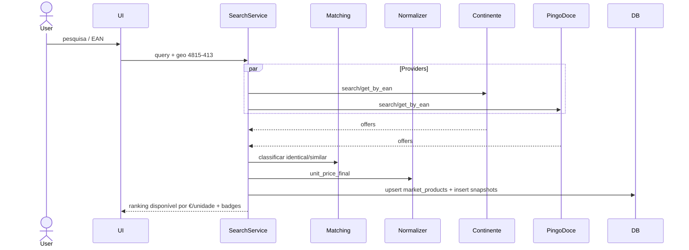
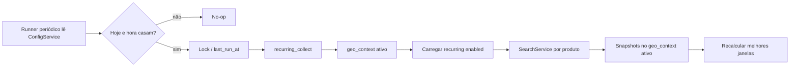
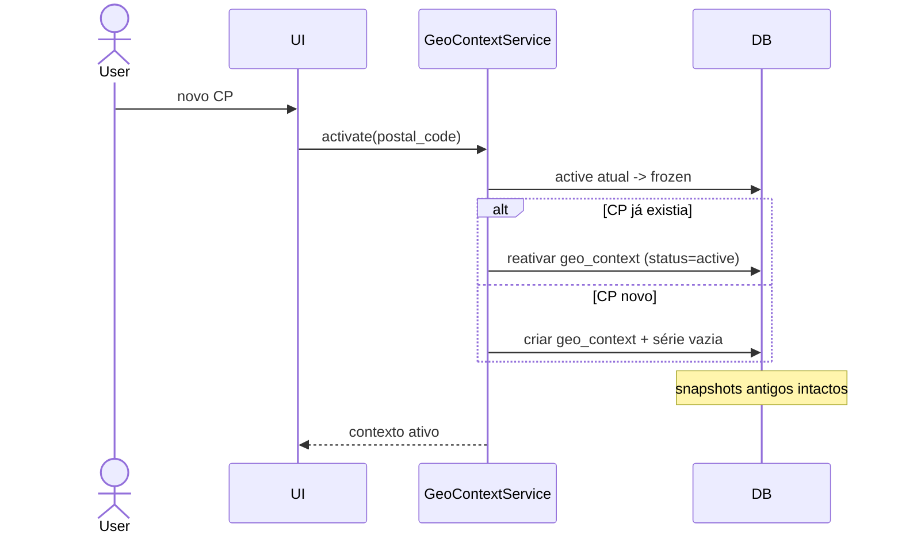

# Arquitetura — Sistema Familiar de Comparação de Preços

Documento de arquitetura da solução (fase teórica).  
Escopo funcional: ver [`docs/MVP_SCOPE.md`](MVP_SCOPE.md).

---

## 1. Princípios

1. **Isolamento total**: repo, app Streamlit, secrets, base de dados e jobs próprios — sem partilha com outros projetos.
2. **Zero hardcode operacional**: postal, agenda do job, mercados ativos, janelas 15/30/60, etc. só via `ConfigService` (defaults apenas como seed). Detalhe em [`CONFIGURATION.md`](CONFIGURATION.md).
3. **Adapters por mercado**: cada supermercado é um provider plugável; falha de um não derruba os outros.
4. **Comparação justa**: ranking por **preço final €/unidade**, só em itens disponíveis.
5. **Histórico imutável e particionado por código postal**: snapshots append-only; cada `geo_context` tem série própria; CP anterior fica congelado; reativar CP retoma a série.
6. **Confirmação humana no matching**: o casal valida matches ambíguos; o sistema memoriza.
7. **MVP primeiro**: Continente + Pingo Doce; Lidl/Intermarché/Aldi entram como stubs e implementação v2.
8. **Simplicidade operacional**: 2 utilizadores, free/low-cost, deploy Cloud Streamlit + storage externo.

---

## 2. Visão de componentes



---

## 3. Estrutura proposta do repositório

Apenas este repositório (`supermercado`). Não partilha código/config com outros apps.

```text
supermercado/
├── app/
│   ├── Home.py                 # entry Streamlit
│   ├── pages/
│   │   ├── 1_Consulta_Avulsa.py
│   │   ├── 2_Listas.py
│   │   ├── 3_Recorrentes.py
│   │   ├── 4_Historico.py
│   │   └── 5_Configuracoes.py
│   └── components/             # widgets UI reutilizáveis
├── src/
│   ├── auth/
│   │   └── allowlist.py
│   ├── domain/                 # entidades e regras puras
│   ├── services/               # orquestração (consulta, lista, oportunidade)
│   ├── matching/
│   ├── normalization/
│   ├── scanning/               # leitura EAN a partir de imagem/código
│   ├── providers/
│   │   ├── base.py
│   │   ├── continente.py
│   │   ├── pingo_doce.py
│   │   ├── lidl.py             # stub v2
│   │   ├── intermarche.py      # stub v2
│   │   └── aldi.py             # stub v2
│   ├── persistence/            # repositórios / SQL
│   └── jobs/
│       └── recurring_collect.py
├── db/
│   ├── schema.sql
│   └── migrations/
├── docs/
│   ├── MVP_SCOPE.md
│   └── ARCHITECTURE.md
├── tests/
├── .streamlit/
│   └── config.toml             # só config não-secreta
├── requirements.txt
├── pyproject.toml              # opcional
├── README.md
└── .gitignore
```

Secrets **nunca** vão para o Git (ficam no painel Streamlit Cloud deste app e/ou `secrets.toml` local ignorado).

---

## 4. Modelo de dados

### 4.1 Diagrama ER (conceitual)



### 4.2 Tabelas principais

#### `users`
| Campo | Tipo | Notas |
|---|---|---|
| id | uuid | PK |
| email | text | único; Gmail |
| display_name | text | |
| active | bool | |
| created_at | timestamptz | |

#### `geo_contexts`
| Campo | Tipo | Notas |
|---|---|---|
| id | uuid | PK |
| postal_code | text | UNIQUE |
| locality | text | ex. Vizela |
| district | text | ex. Braga |
| status | text | `active` \| `frozen` |
| activated_at | timestamptz | |
| deactivated_at | timestamptz | nullable |
| created_at | timestamptz | |
| notes | text | |

Regra: existe **no máximo um** `active` de cada vez. CPs anteriores ficam `frozen` e **nunca** são apagados.

#### `app_settings`
| Campo | Tipo | Notas |
|---|---|---|
| key | text | PK (ex. `recurring_schedule`) |
| value_json | jsonb | payload tipado por chave |
| updated_at | timestamptz | |
| updated_by | uuid | nullable FK users |

#### `settings_audit`
| Campo | Tipo | Notas |
|---|---|---|
| id | bigserial | |
| key | text | |
| old_value | jsonb | |
| new_value | jsonb | |
| changed_by | uuid | |
| changed_at | timestamptz | |

#### `market_preferences`
| Campo | Tipo | Notas |
|---|---|---|
| market_id | text | FK |
| geo_context_id | uuid | FK — preferências de loja **por CP** |
| preferred_store_id | text | nullable |
| preferred_store_name | text | nullable |
| extra_json | jsonb | cookies/context necessários ao provider |
| UNIQUE(market_id, geo_context_id) | | |

#### `markets`
| Campo | Tipo | Notas |
|---|---|---|
| id | text | `continente`, `pingo_doce`, ... |
| name | text | |
| country | text | `PT` |
| enabled | bool | valor inicial via seed; runtime via ConfigService/markets |
| provider_key | text | classe adapter |
| priority | int | ordem de consulta |

#### `products` (produto canónico familiar)
| Campo | Tipo | Notas |
|---|---|---|
| id | uuid | PK |
| name | text | |
| brand | text | nullable / marca própria |
| category | text | |
| quantity_value | numeric | ex. 250 |
| quantity_unit | text | `ml`, `l`, `g`, `kg`, `un` |
| pack_count | int | default 1 |
| ean | text | nullable, indexado |
| attributes_json | jsonb | magro, sem lactose, etc. |
| notes | text | |
| created_by | uuid | FK users |
| created_at | timestamptz | |

#### `market_products` (ocorrência num supermercado)
| Campo | Tipo | Notas |
|---|---|---|
| id | uuid | PK |
| market_id | text | FK |
| external_id | text | pid/sku do site |
| name | text | |
| brand | text | |
| ean | text | nullable |
| quantity_value | numeric | |
| quantity_unit | text | |
| pack_count | int | |
| url | text | |
| image_url | text | |
| raw_json | jsonb | payload parcial do provider |
| last_seen_at | timestamptz | |
| UNIQUE(market_id, external_id) | | |

#### `product_matches`
| Campo | Tipo | Notas |
|---|---|---|
| product_id | uuid | canónico |
| market_product_id | uuid | |
| match_type | text | `identical` / `similar` |
| confidence | numeric | 0–1 |
| confirmed_by_user | bool | |
| confirmed_by | uuid | nullable |
| unit_factor | numeric | ex. 2.0 se 500 ml ≈ 2×250 ml |
| created_at | timestamptz | |
| UNIQUE(product_id, market_product_id) | | |

#### `price_snapshots` (append-only, particionado por CP)
| Campo | Tipo | Notas |
|---|---|---|
| id | bigserial | PK |
| geo_context_id | uuid | FK **obrigatório** — série histórica do CP |
| market_product_id | uuid | FK |
| product_id | uuid | nullable (se já matched) |
| captured_at | timestamptz | |
| price_final | numeric | preço atual/pago |
| price_before | numeric | nullable |
| currency | text | `EUR` |
| is_promo | bool | |
| promo_label | text | nullable |
| promo_valid_until | date | nullable |
| unit_price_final | numeric | **métrica de ranking** |
| unit_basis | text | `l`, `kg`, `un` |
| available | bool | |
| availability_label | text | nullable |
| source | text | `live_query` / `recurring_job` / `manual` |
| INDEX (geo_context_id, product_id, captured_at) | | |

#### `shopping_lists` / `list_items`
- Lista: nome, owner, status (`ativa`, `arquivada`), timestamps
- Item: product_id, quantity desired, notes, selected_market_product_id (opcional), status

#### `recurring_products`
| Campo | Tipo | Notas |
|---|---|---|
| product_id | uuid | PK/FK |
| enabled | bool | |
| cadence | text | `twice_weekly` |
| last_checked_at | timestamptz | |
| next_check_at | timestamptz | |

#### `product_confirmations` / audit leve
- Registo de confirmações manuais de match (quem/quando/de→para)

---

## 5. Camadas e responsabilidades

### 5.1 UI (Streamlit)

- Páginas em português
- Gates de auth no arranque
- Componentes: badge PROMO/NORMAL, badge DISPONÍVEL/INDISPONÍVEL, chip IDÊNTICO/SIMILAR
- Scanner: `st.camera_input` / upload + parser EAN
- Sem lógica de parsing HTML na UI — só chama serviços

### 5.2 Auth

- `st.login("google")` (OIDC nativo)
- Após login: se `email not in ALLOWLIST` → bloquear com mensagem
- Secrets: `client_id`, `client_secret`, `cookie_secret`, `redirect_uri`, `allowed_emails`

### 5.3 Services

| Serviço | Função |
|---|---|
| `ConfigService` | Settings versionados (agenda, janelas, mercados) |
| `GeoContextService` | Activar/congelar CP; continuidade histórica |
| `ScheduleService` | Validar N/dias/hora; `should_run_now()` |
| `ProductService` | CRUD canónico + atributos ricos |
| `SearchService` | consulta avulsa multi-provider |
| `ListService` | listas e otimização simples item-a-item |
| `RecurringService` | registo + disparo de coleta |
| `HistoryService` | janelas configuráveis e gráficos por geo |
| `OpportunityService` | melhor €/unidade atual e histórico **por geo_context_id** |

### 5.4 Normalization

- Converte `quantity_value` + `quantity_unit` → base canónica
- Calcula `unit_price_final = price_final / normalized_amount`
- Exemplos:
  - 500 ml a 1,00 € → 2,00 €/L
  - 250 ml a 0,60 € → 2,40 €/L → 500 ml “ganha” no ranking

### 5.5 Matching Engine

Pipeline:

1. Se EAN presente e bate em `market_products.ean` → `identical` (confiança alta)
2. Score por marca + tokens do nome + atributos + proximidade de quantidade
3. Thresholds:
   - alto → sugerir `identical`
   - médio → `similar` com `unit_factor`
   - baixo → pedir escolha humana
4. Persistência em `product_matches` após confirmação

### 5.6 Price Providers (contrato)

```text
class PriceProvider(Protocol):
    market_id: str
    def search(query: ProductQuery, geo: GeoContext) -> list[Offer]
    def get_by_ean(ean: str, geo: GeoContext) -> list[Offer]
    def healthcheck() -> ProviderStatus
```

`Offer` normalizado:

- external_id, name, brand, ean?
- price_final, price_before?, is_promo, promo_label?, promo_valid_until?
- quantity_value/unit/pack_count
- available, availability_label
- url, image_url, raw

#### Continente (MVP)

- Transporte: HTTP aos controllers SFCC (`Search-UpdateGrid` / páginas de pesquisa)
- Parse HTML estruturado (`data-pid`, preços, PVPR, badges, Indisponível)
- Geo: usar CP `4815-413` + loja preferida quando necessário para stock realista
- Risco: mudanças de markup; stock sem contexto de loja tende a “Indisponível”

#### Pingo Doce (MVP)

- Transporte: SFCC `Search-UpdateGrid`
- Parse de marca, unidade (`1 L | 0,86 €/L`), preço, “Price reduced from…”, “Promoção até”
- Risco: semelhante ao Continente (layout)

#### Lidl / Intermarché / Aldi (v2 stubs)

- Lidl: JSON `data-grid-data` / modelo de oferta semanal
- Intermarché: browser automation (anti-bot)
- Aldi: folhetos/oportunidades da semana
- Stubs devolvem `ProviderStatus.DISABLED` no MVP

---

## 6. Fluxos principais

### 6.1 Consulta avulsa



### 6.2 Lista de compras

1. Utilizador adiciona itens (produto canónico ou busca rápida)
2. Sistema resolve matches por mercado
3. Para cada item: melhor oferta **disponível** por `unit_price_final`
4. Vista agregada: total estimado + indicação do mercado vencedor por linha
5. Utilizador pode substituir similar manualmente

### 6.3 Recorrentes (agenda configurável)



- Seed: terça e sexta, 07:00, `Europe/Lisbon`, 2 execuções
- Alterável em Configurações: N execuções, dias, hora, timezone, enabled
- Runner **nunca** assume dias/hora no código — pergunta ao `ScheduleService.should_run_now()`
- Snapshots gravam-se só no `geo_context` **active**
- **Não** usar schedulers dos outros projetos

### 6.4 Mudança de código postal



### 6.5 Histórico / oportunidades

- Queries sobre `price_snapshots` **sempre** com `geo_context_id`
- Métricas:
  - min(`unit_price_final`) nas janelas configuráveis (seed 15/30/60)
  - mercado do mínimo
  - se o mínimo foi promo
  - preço atual vs mínimo da janela (% acima/abaixo)
- UI pode consultar um CP `frozen` sem o reativar (modo leitura)

---

## 7. Auth, secrets e isolamento

### 7.1 Streamlit Cloud

- App novo dedicado (nome sugerido: `supermercado-familiar` ou `comparador-supermercado`)
- Branch de deploy: `main` deste repo apenas
- Secrets só deste app:

```toml
[auth]
redirect_uri = "https://<app>.streamlit.app/oauth2callback"
cookie_secret = "..."
client_id = "..."
client_secret = "..."
server_metadata_url = "https://accounts.google.com/.well-known/openid-configuration"

[app]
allowed_emails = ["email1@gmail.com", "email2@gmail.com"]
default_postal_code = "4815-413"

[db]
url = "postgresql://..."
```

### 7.2 Isolamento (checklist anti-impacto)

- [ ] Repo Git distinto (`supermercado`)
- [ ] App Streamlit Cloud distinto
- [ ] Secrets distintos
- [ ] Base de dados distinta
- [ ] Cron/Actions só neste repo
- [ ] Sem subir alterações a outros repositórios
- [ ] Sem reutilizar nomes de app/secrets dos projetos existentes

---

## 8. Persistência e ambientes

| Ambiente | App | DB | Providers |
|---|---|---|---|
| Local | `streamlit run app/Home.py` | Postgres local ou Supabase free | Continente + Pingo Doce |
| Produção familiar | Streamlit Cloud (este app) | Supabase/Neon free tier | idem |

SQLite **não** é preferido em Streamlit Cloud (filesystem efémero). Usar Postgres gerido.

---

## 9. Scanner EAN

- Entrada: câmara Streamlit ou upload
- Biblioteca: leitor de código de barras em Python (ex. `pyzbar`/`zxing`/alternativa pura conforme restrições do runtime)
- Fallback: input manual do EAN
- Fluxo: EAN → `get_by_ean` nos providers → se vazio, pesquisa textual assistida pelos atributos do produto encontrado noutro mercado

Se o runtime Cloud limitar libs nativas de visão, MVP entrega **input manual + upload com best-effort**, e documenta degradação graciosa.

---

## 10. Observabilidade e resiliência

- Cada provider: timeout, retry limitado, circuit-breaker simples
- Log de falhas por mercado (UI mostra “Continente indisponível temporariamente”)
- `provider_runs` (opcional): início/fim, itens, erros
- Nunca falhar a página inteira por 1 adapter

Riscos e mitigações:

| Risco | Mitigação |
|---|---|
| Mudança de HTML SFCC | selectors centralizados + testes de contrato |
| Stock falso sem loja | CP + loja preferida; etiqueta “stock não confirmado” |
| Rate limiting | cache curto + job 2×/semana + backoff |
| Anti-bot (futuro Intermarché) | stub até Playwright dedicado |
| Matching errado | confirmação humana + memorização |
| Free tier cold start | healthcheck e mensagem clara |

Conformidade: uso pessoal/familiar de dados publicamente visíveis nos sites; volume baixo; sem redistribuição comercial. Revisar ToS antes de qualquer escala.

---

## 11. Estratégia de testes (obrigatória)

Política completa: [`docs/TESTING.md`](TESTING.md).

**Instrução permanente:** cada etapa/épico só conclui com suite completa verde
(unit + functional + e2e + navegação simulada). Falhas ⇒ reconstruir até passar.

Camadas:

1. **Unitários** (`tests/unit/`): normalizer, matching, validação de agenda
2. **Funcionais** (`tests/functional/`): CP freeze/resume, search+snapshots, schedule
3. **E2E** (`tests/e2e/`): páginas Streamlit via `AppTest` / fluxos ponta-a-ponta
4. **Utilizadores simulados** (`tests/simulated_users/`): roteiros familiares de navegação
5. **Contrato providers**: fixtures HTML Continente/Pingo Doce
6. **Revisão contínua**: actualizar testes sempre que o comportamento mudar

Gate ao fim de cada etapa:

```bash
export PYTHONPATH=src SUPERMERCADO_DEV_BYPASS=1
python3 -m pytest -q
# ou: python3 -m tests.run_all
```

---

## 12. Roadmap de implementação (pós-aprovação desta arquitetura)

Ordem estrita:

1. Bootstrap repo + requirements + `.gitignore` + README
2. Schema DB + camada persistence
3. Auth Google + allowlist
4. Domain + normalizer + matching (com testes)
5. `ContinenteProvider` + `PingoDoceProvider`
6. Consulta avulsa + snapshots
7. Listas de compras
8. Histórico 15/30/60 + badges
9. Recorrentes + job 2×/semana
10. Scanner EAN (best-effort)
11. Deploy Streamlit Cloud isolado
12. Stubs v2 Lidl/Intermarché/Aldi visíveis como “em breve”

---

## 13. Decisões abertas menores (não bloqueiam)

1. Nome público do app Streamlit
2. Provider Postgres: Supabase vs Neon
3. Biblioteca concreta de leitura de EAN conforme limites do Cloud
4. Lojas preferidas exactas em Vizela/arredores (seleção na primeira configuração)

**Fechado:** agenda seed terça/sexta 07:00 Lisbon; config dinâmica; histórico particionado por CP.


---

## 14. Aprovação

Este documento + `MVP_SCOPE.md` constituem a base teórica para iniciar a **construção real** (bootstrap de ambientes → módulos → deploy), sem afetar os outros dois sistemas.
